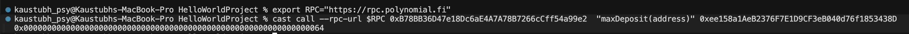

- Deploy the ERC20 & ERC4626 using `forge` or `hardhat`
  - [Deploy ERC20 tx](https://polynomialscan.io/tx/0x041cc78ca0713302e037ec973b9d68a0ee3b7ab8b4af4bf8e03bb0ba91582349)
  - [Deploy Vault tx](https://polynomialscan.io/tx/0x8ca67ed0196a35990583ba394ea2ad6e3a260722198c873cebdadca691503653)
- Call the view functions using `cast call` and verify the output
  - 
- Generate calldata using `cast calldata` and send a tx using `cast send`
    - [ERC20.approve()](https://polynomialscan.io/tx/0x3ed9e6285ae8cb28445d34c4b184e21950908551b9023a8a6a672753f0f1bd31)
    - [ERC20.transfer()](https://polynomialscan.io/tx/0xaae8e8e00250bb84dc7b947cf2f4dce14859abdac8b59a4a7e93bc275401f0f7)
    - [ERC4626.deposit()](https://polynomialscan.io/tx/0x28ac33f8e2d40d5c2dfc6ad34f900aee94ebb0a2d7d5f2b76a511220017444c2)
    - [ERC4626.mint()](https://polynomialscan.io/tx/0x43576abc58780e82d3d681973cef72afcb61e177fc95dc639efb7bd081700f49)
    - [ERC4626.withdraw()](https://polynomialscan.io/tx/0x2719de7bf40391849d0ccd2ff8cf50bc21dd904787c92cda2897c49c263a0db1)
    - [ERC4626.redeeem()](https://polynomialscan.io/tx/0xaa3d91413856bd19fc0e66266d7701da920bb11d39d97f5c9a80e874f4504088)